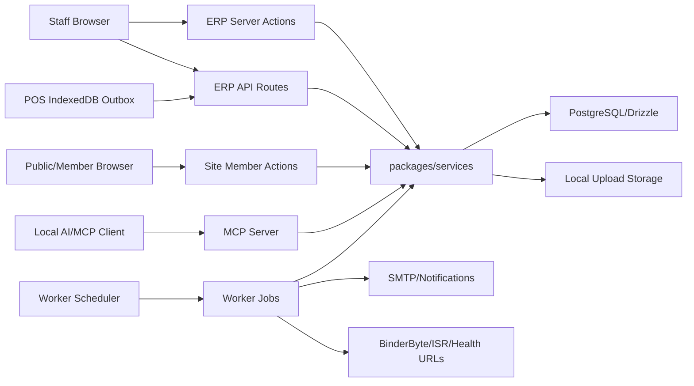

# Aroadritea ERP - Phase 1 Attack Surface Map

**Date:** 2026-05-21
**Task:** T-0168
**Baseline commit:** `5970cfc`
**Current head during mapping:** `8a103f7`

This document maps the critical entry points, trust boundaries, and sensitive data flows for the security and data-integrity audit requested in T-0168. It is intentionally written before static findings and code fixes so later findings can be tied back to concrete surfaces.

## Scope Inventory

| Surface | Approx. files | Primary paths | Notes |
|---|---:|---|---|
| ERP server actions | 50 | `apps/web/app/(dash)/**/actions.ts` | Main authenticated mutation and reporting surface. Must enforce session, permission, tenant, and location scope. |
| ERP API routes | 7 | `apps/web/app/api/**/route.ts` | Auth, upload, private upload serving, journal attachment download, POS offline sync, health. |
| Public/member site actions and APIs | 4 | `apps/site/actions/member.ts`, `apps/site/app/api/**` | Member signup/login/OTP/password reset plus career endpoints. |
| MCP tools | 7 tool files | `apps/mcp/src/tools/**` | External AI automation surface. Every tool must validate Zod input and reuse the same permission model as UI. |
| Worker jobs | 7 | `apps/worker/src/jobs/**` | Backup, payroll batch, stock alerts, party-ledger reminders, ISR, outage monitor. |
| Service layer | 94 | `packages/services/src/**` | Business rules, Result/AppError boundary, double-entry, POS, inventory, HR, tax, reporting. |
| Offline/PWA | 8 | `packages/offline/src/**`, `apps/web/service-worker/**` | POS outbox, demo DB, sync transport, cache boundary. |

## Trust Boundaries

| Boundary | Trusted side | Untrusted side | Required controls |
|---|---|---|---|
| Staff browser to ERP server actions | `apps/web` server actions and service layer | Browser-controlled `FormData`, JSON action args, query params | `requireSession()`, `requirePermission()`, Zod validation, tenant/location scoping, audit log for mutations. |
| Staff browser to ERP API routes | Next.js route handlers | Upload bytes, sync payloads, URL params | Session guard, size/type checks, ownership check, idempotency, no raw internal IDs in UI output. |
| Public visitor/member to site actions | `apps/site/actions/member.ts` and member service | Signup/login/OTP/reset form data | Turnstile where required, rate limiting, OTP expiry and single-use, password hashing, encrypted PII. |
| MCP client to ERP data | `apps/mcp/src/server.ts`, `auth.ts`, tool handlers | Bearer token and tool inputs | Per-request token verification, Zod schema per tool, `can()` permission checks, tenant/location scope, audit trail. |
| Worker to third-party/services | Worker jobs and notification services | SMTP, ISR endpoint, health URLs, BinderByte API | Domain allowlist where applicable, fail-closed config, retry/alert behavior, cached API responses to respect quota. |
| Upload storage to app | `apps/web/lib/upload-storage.ts`, `journal-attachment-storage.ts` | File names, MIME type, metadata JSON | Sanitized filenames, path traversal defense, private-read permission checks, metadata tenant validation. |
| Offline POS to server sync | `/api/sync/pos` and POS services | IndexedDB outbox data, client timestamps, client sale IDs | Session guard, location permission, idempotency key, clock-skew rejection, atomic sale+journal+stock transaction. |

## Sensitive Data Flows

### Authentication and Member PII

1. Member signup starts at `apps/site/actions/member.ts`.
2. Data enters `packages/services/src/member/index.ts`.
3. Email/phone are normalized and stored with encryption helpers from `packages/services/src/security/pii.ts`.
4. OTP rows live in `member_otp_codes`, must expire and be single-use.
5. Password hashes use `packages/services/src/member/password.ts`.
6. Member sessions live in `member_sessions`, and password reset now revokes existing sessions.

Audit focus: rate limits, Turnstile boundaries, OTP randomness, session invalidation, duplicate "complete signup" failure, and no plaintext PII in logs/audit.

### Staff Auth and RBAC

1. ERP login enters `apps/web/app/api/auth/[...all]/route.ts` and `packages/services/src/auth/**`.
2. Authenticated server actions call `requireSession()` and, for protected modules, permission checks.
3. Permission matrix is database-driven through IAM services and `can()`.
4. MCP token auth maps token to user, tenant, locale, and optional location.

Audit focus: server actions lacking permission checks, hardcoded role gates, missing tenant/location filters, and upload/attachment ownership.

### Money and Accounting

1. Manual journals, POS sales, manual sales closing, purchasing, payroll, AP/AR, fixed assets, petty cash, reimbursement, and donation flows create journal entries.
2. Journals pass through `packages/services/src/accounting/create-journal.ts` and `post-journal.ts`.
3. Posting must enforce debit equals credit, open period, tenant/location, IDR currency, and audit trail.
4. Automatic journals must resolve configurable account IDs rather than hardcoded accounts.

Audit focus: money precision, period-close bypass, journal reversal idempotency, AP/AR due-date fields, fixed-asset and AP/AR journal synchronization, and historical transaction deletion rules.

### POS and Inventory

1. POS UI calls `apps/web/app/(dash)/pos/actions.ts`.
2. Offline POS sync calls `apps/web/app/api/sync/pos/route.ts`.
3. Sales enter `packages/services/src/pos/create-sale.ts`, post journals, and deduct inventory/BOM where configured.
4. Stock movement, adjustment, transfer, and opname live in `packages/services/src/inventory/**`.

Audit focus: atomic transaction boundaries, idempotency, refund ceiling, stock not going negative without explicit permission, flexible BOM auto-deduct flags, and no demo-mode production writes.

### Public CMS, Careers, and Content

1. Public pages read CMS records and static message files.
2. Career forms hit `apps/site/app/api/careers/apply/route.ts`.
3. CMS/admin mutations enter `apps/web/app/(dash)/cms/actions.ts`.

Audit focus: draft visibility, Markdown/content XSS, upload type/size restrictions, i18n fallback keys, and ISR revalidation auth.

### Worker Jobs and Notifications

1. `apps/worker/src/scheduler.ts` reads `scheduled_jobs` and dispatches named handlers.
2. `party-ledger-reminders` reads posted journal lines with due dates and sends configured notifications.
3. `stock-low-alert`, `outage-monitor`, `payroll-batch`, `backup`, and `isr-revalidate` are separate jobs.

Audit focus: silent failures, duplicate runs, tenant scoping, external alert delivery, backup fail-closed behavior, and not logging secrets/PII.

## Critical Entry Point Checklist For Fase 2-4

| Area | Entry points to inspect first | Risk |
|---|---|---|
| Upload/private files | `apps/web/app/api/uploads/**`, `journal-attachments/**` | Cross-tenant file read, path traversal, unsafe public uploads. |
| POS sync | `apps/web/app/api/sync/pos/route.ts`, `packages/offline/src/sync.ts` | Duplicate sales, future timestamps, location bypass. |
| Accounting mutations | `accounting/**/actions.ts`, `packages/services/src/accounting/**` | Journal imbalance, closed-period bypass, money precision. |
| AP/AR reminders | `apps/worker/src/jobs/party-ledger-reminders.ts`, `party-ledger-actions.ts` | Failed reminders, duplicate notification, tenant leak. |
| Member signup/reset | `apps/site/actions/member.ts`, `packages/services/src/member/index.ts` | Auth bypass, token replay, duplicate profile completion failure. |
| MCP writes | `apps/mcp/src/tools/accounting.ts`, `phase2.ts`, `tax.ts` | Missing permission or location scope in machine-facing API. |
| Public CMS/careers | `apps/site/app/api/careers/**`, CMS actions | XSS, unsafe uploads, accidental draft publish. |

## Mermaid Data Flow

## Fase 1 Conclusion

The highest-priority audit paths are upload ownership, POS offline sync, accounting money/period controls, AP/AR reminders, member signup/reset, and MCP write tools. Fase 2 static analysis will collect grep-based findings against these surfaces before fixes are applied.
